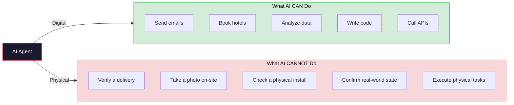
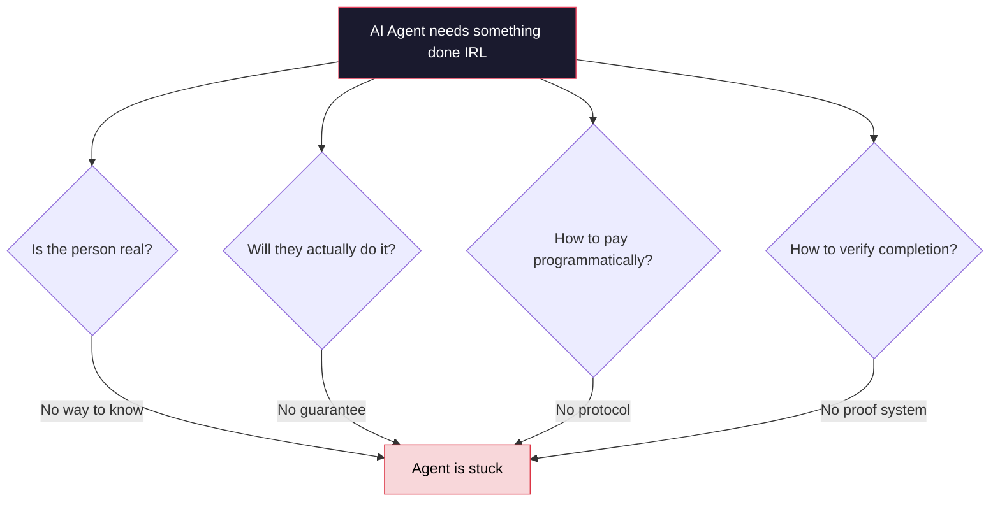

# The Problem

```mermaid
graph LR
    AI["AI Agent"]

    subgraph CAN["What AI CAN Do"]
        direction TB
        A1["Send emails"]
        A2["Book hotels"]
        A3["Analyze data"]
        A4["Write code"]
        A5["Call APIs"]
    end

    subgraph CANT["What AI CANNOT Do"]
        direction TB
        B1["Verify a delivery"]
        B2["Take a photo on-site"]
        B3["Check a physical install"]
        B4["Confirm real-world state"]
        B5["Execute physical tasks"]
    end

    AI -->|"Digital"| CAN
    AI -->|"Physical"| CANT

    style CAN fill:#d4edda,stroke:#28a745,color:#000
    style CANT fill:#f8d7da,stroke:#dc3545,color:#000
    style AI fill:#1a1a2e,stroke:#e94560,color:#fff
```

### The Gap

```mermaid
graph TD
    AGENT["AI Agent needs something done IRL"]
    Q1{"Is the person real?"}
    Q2{"Will they actually do it?"}
    Q3{"How to pay programmatically?"}
    Q4{"How to verify completion?"}
    STUCK["Agent is stuck"]

    AGENT --> Q1
    Q1 -->|"No way to know"| STUCK
    AGENT --> Q2
    Q2 -->|"No guarantee"| STUCK
    AGENT --> Q3
    Q3 -->|"No protocol"| STUCK
    AGENT --> Q4
    Q4 -->|"No proof system"| STUCK

    style STUCK fill:#f8d7da,stroke:#dc3545,color:#000
    style AGENT fill:#1a1a2e,stroke:#e94560,color:#fff
```
