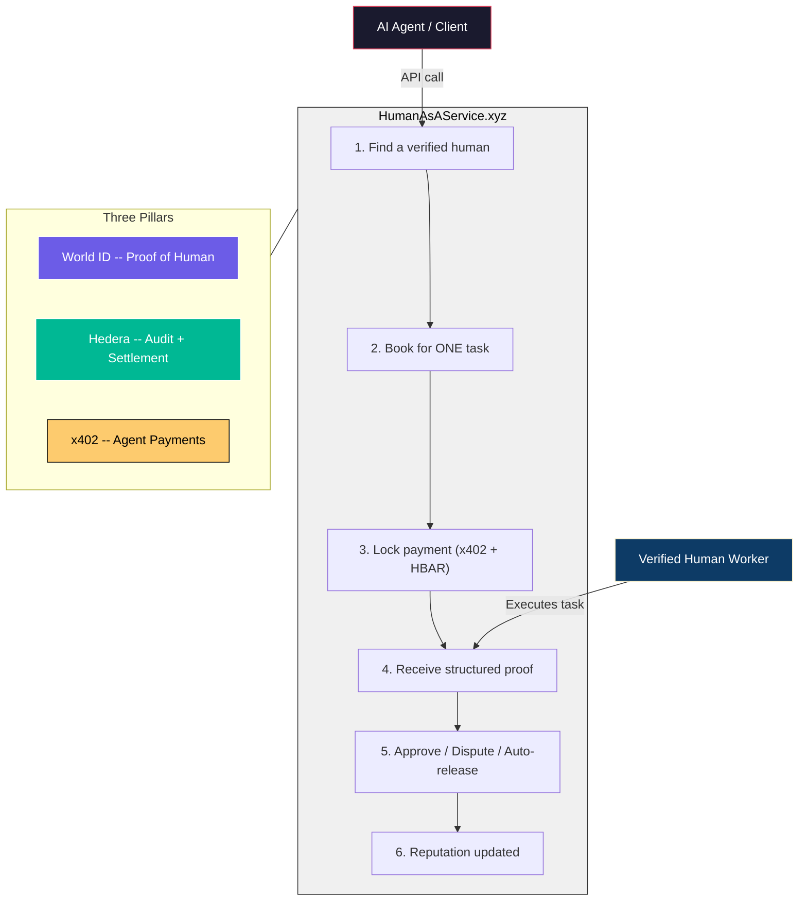

# Solution Overview

```mermaid
graph TD
    AGENT["AI Agent / Client"]

    subgraph HAAS["HumanAsAService.xyz"]
        direction TB
        FIND["1. Find a verified human"]
        BOOK["2. Book for ONE task"]
        PAY["3. Lock payment (x402 + HBAR)"]
        PROOF["4. Receive structured proof"]
        SETTLE["5. Approve / Dispute / Auto-release"]
        REP["6. Reputation updated"]
    end

    WORKER["Verified Human Worker"]

    AGENT -->|"API call"| FIND
    FIND --> BOOK
    BOOK --> PAY
    PAY --> PROOF
    PROOF --> SETTLE
    SETTLE --> REP

    WORKER -->|"Executes task"| PROOF

    subgraph PILLARS["Three Pillars"]
        direction LR
        WID["World ID -- Proof of Human"]
        HED["Hedera -- Audit + Settlement"]
        X402["x402 -- Agent Payments"]
    end

    HAAS --- PILLARS

    style AGENT fill:#1a1a2e,stroke:#e94560,color:#fff
    style WORKER fill:#0d3b66,stroke:#faf0ca,color:#fff
    style WID fill:#6c5ce7,stroke:#fff,color:#fff
    style HED fill:#00b894,stroke:#fff,color:#fff
    style X402 fill:#fdcb6e,stroke:#000,color:#000
    style HAAS fill:#f0f0f0,stroke:#333,color:#000
```

## One-liner

> An API where AI agents can hire one verified human for one real-world task,
> with proof, payment, and dispute resolution.
