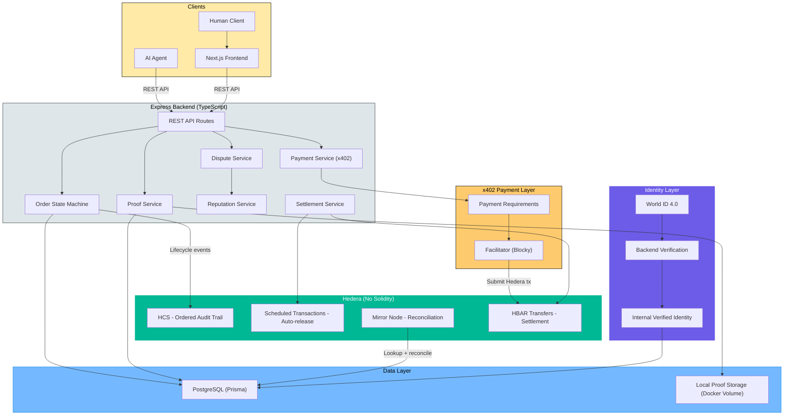

# Architecture

```mermaid
graph TB
    subgraph CLIENTS["Clients"]
        direction LR
        AGENT["AI Agent"]
        HUMAN_CLIENT["Human Client"]
        WEB["Next.js Frontend"]
    end

    subgraph API_LAYER["Express Backend (TypeScript)"]
        direction TB
        ROUTES["REST API Routes"]
        OSM["Order State Machine"]
        PAYMENT["Payment Service (x402)"]
        PROOF_SVC["Proof Service"]
        DISPUTE["Dispute Service"]
        REPUTATION["Reputation Service"]
        SETTLE["Settlement Service"]
    end

    subgraph IDENTITY["Identity Layer"]
        WORLDID["World ID 4.0"]
        VERIFY["Backend Verification"]
        INTERNAL_ID["Internal Verified Identity"]
    end

    subgraph DATA["Data Layer"]
        PG["PostgreSQL (Prisma)"]
        PROOFS["Local Proof Storage (Docker Volume)"]
    end

    subgraph HEDERA["Hedera (No Solidity)"]
        direction TB
        HCS["HCS - Ordered Audit Trail"]
        SCHED["Scheduled Transactions - Auto-release"]
        MIRROR["Mirror Node - Reconciliation"]
        TRANSFERS["HBAR Transfers - Settlement"]
    end

    subgraph X402_LAYER["x402 Payment Layer"]
        X402_REQ["Payment Requirements"]
        FACILITATOR["Facilitator (Blocky)"]
    end

    AGENT -->|"REST API"| ROUTES
    HUMAN_CLIENT --> WEB
    WEB -->|"REST API"| ROUTES

    ROUTES --> OSM
    ROUTES --> PAYMENT
    ROUTES --> PROOF_SVC
    ROUTES --> DISPUTE

    OSM --> PG
    PROOF_SVC --> PROOFS
    PROOF_SVC --> PG

    PAYMENT --> X402_REQ
    X402_REQ --> FACILITATOR
    FACILITATOR -->|"Submit Hedera tx"| TRANSFERS

    SETTLE --> TRANSFERS
    SETTLE --> SCHED

    OSM -->|"Lifecycle events"| HCS
    DISPUTE --> REPUTATION
    MIRROR -->|"Lookup + reconcile"| PG

    WORLDID --> VERIFY
    VERIFY --> INTERNAL_ID
    INTERNAL_ID --> PG

    style HEDERA fill:#00b894,stroke:#fff,color:#fff
    style IDENTITY fill:#6c5ce7,stroke:#fff,color:#fff
    style X402_LAYER fill:#fdcb6e,stroke:#000,color:#000
    style API_LAYER fill:#dfe6e9,stroke:#2d3436,color:#000
    style DATA fill:#74b9ff,stroke:#0984e3,color:#000
    style CLIENTS fill:#ffeaa7,stroke:#000,color:#000
```
