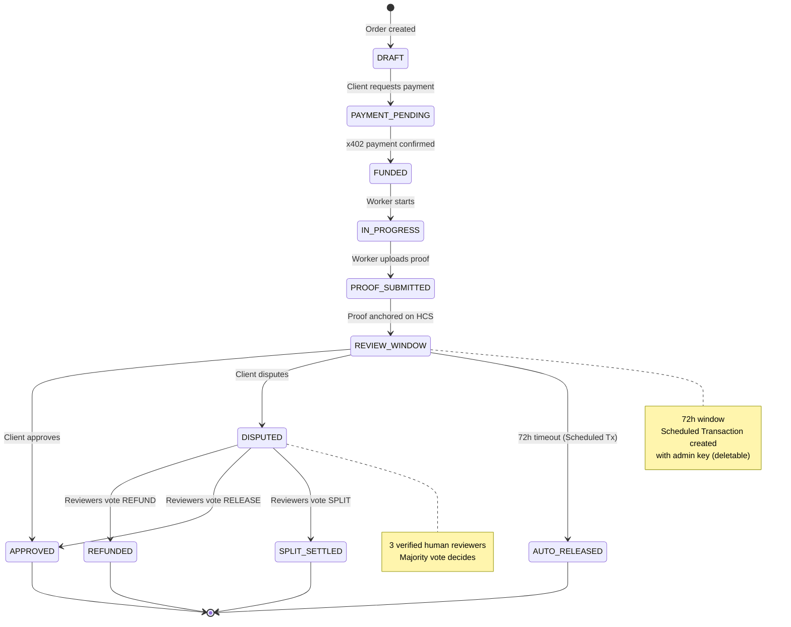
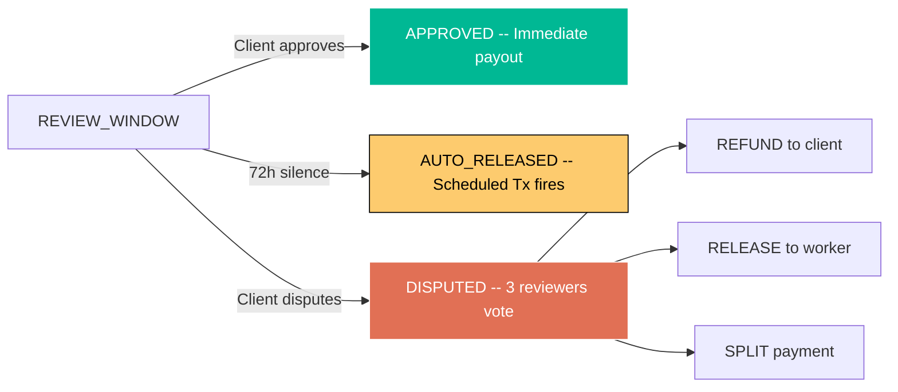

# Order State Machine

```mermaid
stateDiagram-v2
    [*] --> DRAFT: Order created

    DRAFT --> PAYMENT_PENDING: Client requests payment

    PAYMENT_PENDING --> FUNDED: x402 payment confirmed

    FUNDED --> IN_PROGRESS: Worker starts

    IN_PROGRESS --> PROOF_SUBMITTED: Worker uploads proof

    PROOF_SUBMITTED --> REVIEW_WINDOW: Proof anchored on HCS

    REVIEW_WINDOW --> APPROVED: Client approves
    REVIEW_WINDOW --> DISPUTED: Client disputes
    REVIEW_WINDOW --> AUTO_RELEASED: 72h timeout (Scheduled Tx)

    DISPUTED --> REFUNDED: Reviewers vote REFUND
    DISPUTED --> APPROVED: Reviewers vote RELEASE
    DISPUTED --> SPLIT_SETTLED: Reviewers vote SPLIT

    APPROVED --> [*]
    AUTO_RELEASED --> [*]
    REFUNDED --> [*]
    SPLIT_SETTLED --> [*]

    note right of REVIEW_WINDOW
        72h window
        Scheduled Transaction created
        with admin key (deletable)
    end note

    note right of DISPUTED
        3 verified human reviewers
        Majority vote decides
    end note
```

## Three Settlement Paths

```mermaid
graph LR
    RW["REVIEW_WINDOW"]

    RW -->|"Client approves"| HAPPY["APPROVED -- Immediate payout"]
    RW -->|"72h silence"| TIMEOUT["AUTO_RELEASED -- Scheduled Tx fires"]
    RW -->|"Client disputes"| DISPUTE["DISPUTED -- 3 reviewers vote"]

    DISPUTE --> REFUND["REFUND to client"]
    DISPUTE --> RELEASE["RELEASE to worker"]
    DISPUTE --> SPLIT["SPLIT payment"]

    style HAPPY fill:#00b894,stroke:#fff,color:#fff
    style TIMEOUT fill:#fdcb6e,stroke:#000,color:#000
    style DISPUTE fill:#e17055,stroke:#fff,color:#fff
```
