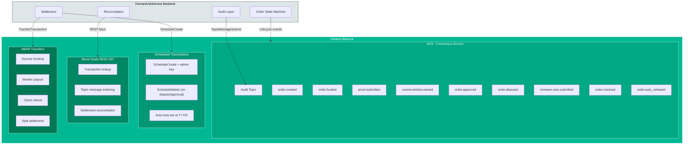
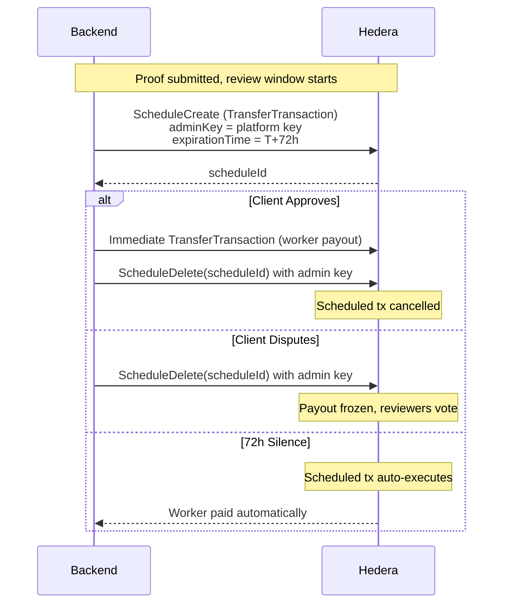

# Hedera Native Services (Zero Solidity)

```mermaid
graph TB
    subgraph APP["HumanAsAService Backend"]
        OSM["Order State Machine"]
        SETTLE["Settlement"]
        AUDIT["Audit Layer"]
        RECONCILE["Reconciliation"]
    end

    subgraph HEDERA["Hedera Network"]
        subgraph HCS_BOX["HCS - Consensus Service"]
            TOPIC["Audit Topic"]
            E1["order.created"]
            E2["order.funded"]
            E3["proof.submitted"]
            E4["review.window.started"]
            E5["order.approved"]
            E6["order.disputed"]
            E7["reviewer.vote.submitted"]
            E8["order.resolved"]
            E9["order.auto_released"]
        end

        subgraph SCHED_BOX["Scheduled Transactions"]
            CREATE["ScheduleCreate + admin key"]
            DELETE["ScheduleDelete (on dispute/approval)"]
            EXEC["Auto-execute at T+72h"]
        end

        subgraph MIRROR_BOX["Mirror Node REST API"]
            TX_LOOKUP["Transaction lookup"]
            MSG_INDEX["Topic message indexing"]
            RECON["Settlement reconciliation"]
        end

        subgraph TRANSFER_BOX["HBAR Transfers"]
            FUND["Escrow funding"]
            RELEASE["Worker payout"]
            REFUND["Client refund"]
            SPLIT["Split settlement"]
        end
    end

    AUDIT -->|"TopicMessageSubmit"| TOPIC
    OSM -->|"Lifecycle events"| HCS_BOX
    SETTLE -->|"TransferTransaction"| TRANSFER_BOX
    SETTLE -->|"ScheduleCreate"| SCHED_BOX
    RECONCILE -->|"REST fetch"| MIRROR_BOX

    style HEDERA fill:#00b894,stroke:#fff,color:#fff
    style HCS_BOX fill:#00a884,stroke:#fff,color:#fff
    style SCHED_BOX fill:#009874,stroke:#fff,color:#fff
    style MIRROR_BOX fill:#008864,stroke:#fff,color:#fff
    style TRANSFER_BOX fill:#007854,stroke:#fff,color:#fff
    style APP fill:#dfe6e9,stroke:#2d3436,color:#000
```

## Key Design Decision: Admin Key

```mermaid
sequenceDiagram
    participant B as Backend
    participant H as Hedera
    
    Note over B,H: Proof submitted, review window starts
    
    B->>H: ScheduleCreate (TransferTransaction)<br/>adminKey = platform key<br/>expirationTime = T+72h
    H-->>B: scheduleId

    alt Client Approves
        B->>H: Immediate TransferTransaction (worker payout)
        B->>H: ScheduleDelete(scheduleId) with admin key
        Note over H: Scheduled tx cancelled
    else Client Disputes
        B->>H: ScheduleDelete(scheduleId) with admin key
        Note over H: Payout frozen, reviewers vote
    else 72h Silence
        Note over H: Scheduled tx auto-executes
        H-->>B: Worker paid automatically
    end
```
