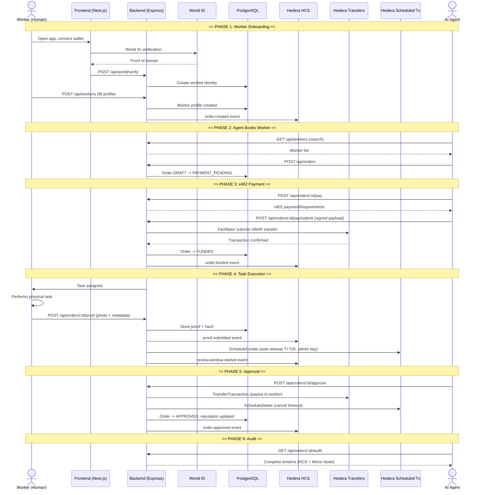

# Demo Flow - Happy Path

```mermaid
sequenceDiagram
    actor W as Worker (Human)
    participant WEB as Frontend (Next.js)
    participant API as Backend (Express)
    participant WID as World ID
    participant PG as PostgreSQL
    participant HCS as Hedera HCS
    participant HTX as Hedera Transfers
    participant SCH as Hedera Scheduled Tx
    actor A as AI Agent

    Note over W,A: == PHASE 1: Worker Onboarding ==

    W->>WEB: Open app, connect wallet
    WEB->>WID: World ID verification
    WID-->>WEB: Proof of human
    WEB->>API: POST /api/world/verify
    API->>PG: Create verified identity
    W->>API: POST /api/workers (fill profile)
    API->>PG: Worker profile created
    API->>HCS: order.created event

    Note over W,A: == PHASE 2: Agent Books Worker ==

    A->>API: GET /api/workers (search)
    API-->>A: Worker list
    A->>API: POST /api/orders
    API->>PG: Order DRAFT -> PAYMENT_PENDING

    Note over W,A: == PHASE 3: x402 Payment ==

    A->>API: POST /api/orders/:id/pay
    API-->>A: x402 paymentRequirements
    A->>API: POST /api/orders/:id/pay/submit (signed payload)
    API->>HTX: Facilitator submits HBAR transfer
    HTX-->>API: Transaction confirmed
    API->>PG: Order -> FUNDED
    API->>HCS: order.funded event

    Note over W,A: == PHASE 4: Task Execution ==

    API->>W: Task assigned
    W->>W: Performs physical task
    W->>API: POST /api/orders/:id/proof (photo + metadata)
    API->>PG: Store proof + hash
    API->>HCS: proof.submitted event
    API->>SCH: ScheduleCreate (auto-release T+72h, admin key)
    API->>HCS: review.window.started event

    Note over W,A: == PHASE 5: Approval ==

    A->>API: POST /api/orders/:id/approve
    API->>HTX: TransferTransaction (payout to worker)
    API->>SCH: ScheduleDelete (cancel timeout)
    API->>PG: Order -> APPROVED, reputation updated
    API->>HCS: order.approved event

    Note over W,A: == PHASE 6: Audit ==

    A->>API: GET /api/orders/:id/audit
    API-->>A: Complete timeline (HCS + Mirror Node)
```
