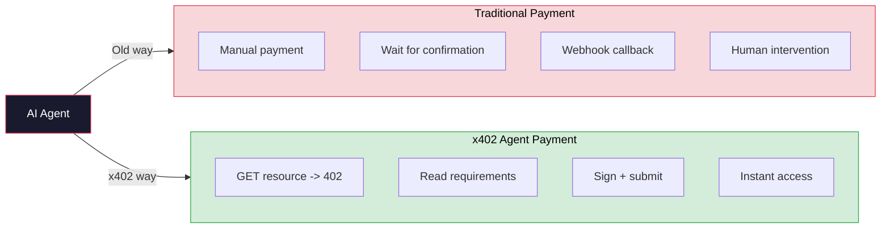

# x402 Payment Flow

```mermaid
sequenceDiagram
    actor A as AI Agent
    participant API as HaaS Backend
    participant F as Facilitator (Blocky)
    participant H as Hedera Network
    participant M as Mirror Node

    A->>API: POST /api/orders/:id/pay
    API-->>A: 402 Payment Required<br/>paymentRequirements {<br/>  scheme: "exact"<br/>  network: "hedera-testnet"<br/>  maxAmountRequired: "100000000" (tinybars)<br/>  payTo: "0.0.escrow"<br/>  asset: "0.0.0" (HBAR)<br/>}

    Note over A: Agent signs payment payload

    A->>API: POST /api/orders/:id/pay/submit<br/>{x402PaymentId, signedPayload}

    API->>F: Forward to facilitator<br/>/verify + /settle
    F->>F: Verify payment validity
    F->>H: Submit TransferTransaction
    H-->>F: Transaction receipt (SUCCESS)
    F-->>API: {success: true, hederaTxId, payerAccount}

    API->>M: Verify tx on Mirror Node (optional)
    M-->>API: Transaction confirmed

    API->>API: Update order -> FUNDED
    API->>API: Write HCS audit event

    API-->>A: {funded: true, hederaTxId, orderStatus: "FUNDED"}

    style A fill:#1a1a2e,stroke:#e94560,color:#fff
```

## Why x402?


