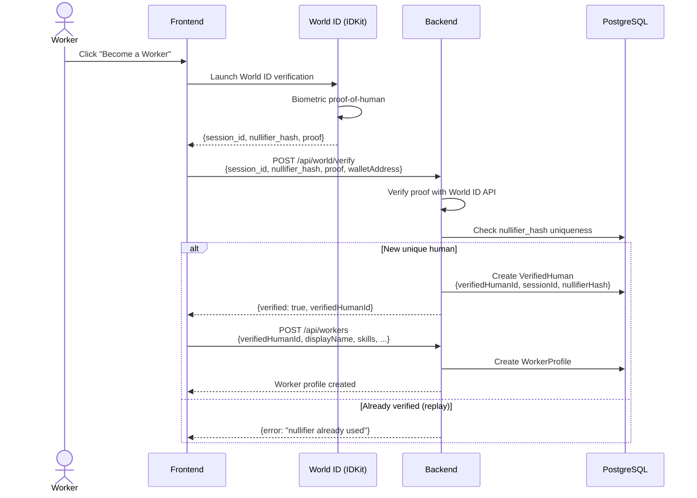
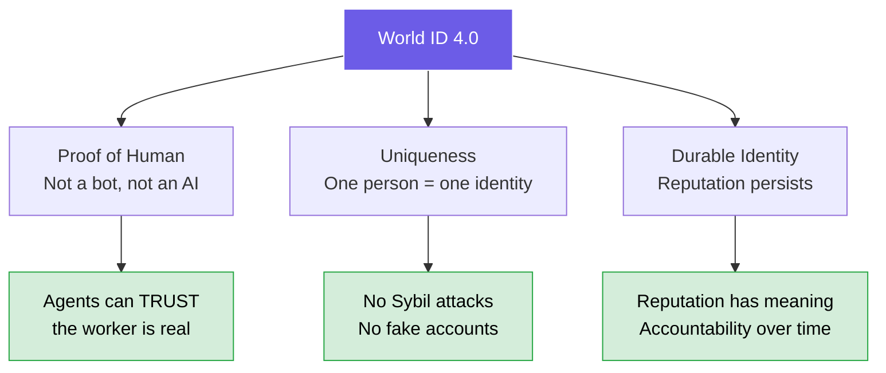

# World ID Integration

```mermaid
sequenceDiagram
    actor W as Worker
    participant WEB as Frontend
    participant WIDKIT as World ID (IDKit)
    participant API as Backend
    participant PG as PostgreSQL

    W->>WEB: Click "Become a Worker"
    WEB->>WIDKIT: Launch World ID verification
    WIDKIT->>WIDKIT: Biometric proof-of-human
    WIDKIT-->>WEB: {session_id, nullifier_hash, proof}

    WEB->>API: POST /api/world/verify<br/>{session_id, nullifier_hash, proof, walletAddress}
    
    API->>API: Verify proof with World ID API
    API->>PG: Check nullifier_hash uniqueness
    
    alt New unique human
        API->>PG: Create VerifiedHuman<br/>{verifiedHumanId, sessionId, nullifierHash}
        API-->>WEB: {verified: true, verifiedHumanId}
        WEB->>API: POST /api/workers<br/>{verifiedHumanId, displayName, skills, ...}
        API->>PG: Create WorkerProfile
        API-->>WEB: Worker profile created
    else Already verified (replay)
        API-->>WEB: {error: "nullifier already used"}
    end
```

## Why World ID Matters

```mermaid
graph TD
    WID["World ID 4.0"]
    
    WID --> POH["Proof of Human<br/>Not a bot, not an AI"]
    WID --> UNIQUE["Uniqueness<br/>One person = one identity"]
    WID --> DURABLE["Durable Identity<br/>Reputation persists"]
    
    POH --> TRUST["Agents can TRUST<br/>the worker is real"]
    UNIQUE --> SYBIL["No Sybil attacks<br/>No fake accounts"]
    DURABLE --> REP["Reputation has meaning<br/>Accountability over time"]

    style WID fill:#6c5ce7,stroke:#fff,color:#fff
    style TRUST fill:#d4edda,stroke:#28a745,color:#000
    style SYBIL fill:#d4edda,stroke:#28a745,color:#000
    style REP fill:#d4edda,stroke:#28a745,color:#000
```
